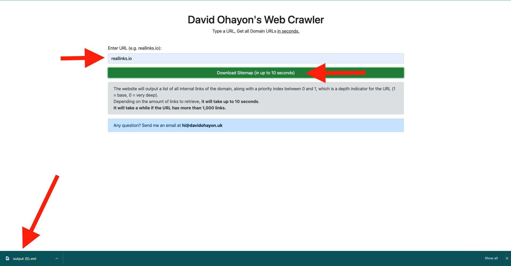
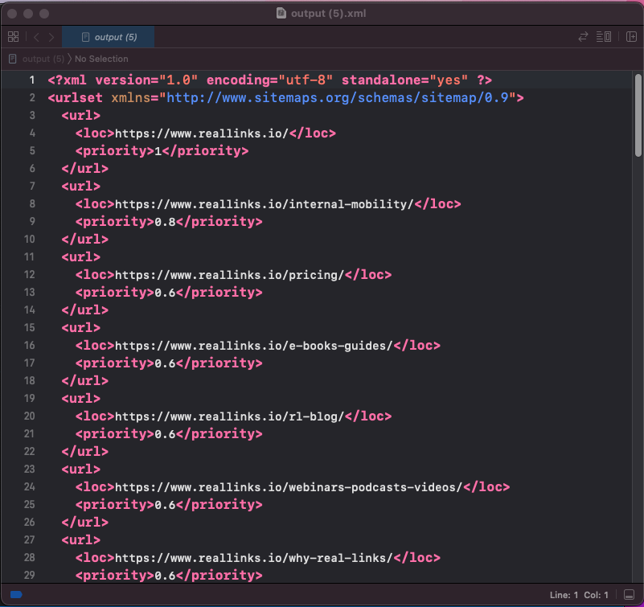

# 🔗 WebCrawler (RealLinks.io)

A Simple Web Crawler - type in a URL, and get all domain URLs in seconds.  

This Web Crawler has been designed using JavaScript, Node.js, EJS, Express.js, Bootstrap, Nodemon and the `sitemap-generator` npm package. 

## What it does 🤔
Go to `localhost:1000`. You will see a webpage with a search bar, a submit button, and some directions on how to use the Crawler and relevant guidance.  

When you click on **Download**, it will fetch all URLs within the domain provided, and download its sitemap  in an `xml` file in up to 10 seconds.  

The `xml` will include all internal domain urls, along with a priority indicator that will show how "deep" the URL is. It is on a 0 to 1 scale, the lower it is, the deeper it is.   

If you need any help, or go through any issue with the WebCrawler, I have included my email address. Please send a description of the problem, plus steps, screenshots and info about your OS & System to make it easier for me to help 😊

## How it was built ⚒️
This Web Crawler has been build in exactly 6 hours using the technology mentioned in the intro. It uses only four packages:
* **Express.js** - for the backend.
* **EJS** - for HTML templating.
* **Sitemap Generator** - `npm` package used to build the sitemap generation functionality.
It also uses **Bootstrap** to design the Front-End, **Nodemon** to make it easier to work with Node.  

It has been built with **simplicity and functionality** in mind. My goal was to build a user-friendly webpage which allows to simply, and quickly get a Sitemap for any domain, without having to user the command line. 
 
It uses simple GET & POST requests and gets the job done in about ±50 lines of code. It has only one function - the `generator` function - and uses the packages' built-in error catching feature to process/analyse any arising bugs. 

I picked the `sitemap-generator` package for its ease-of-use, readability, and because of its 2,000 weekly downloads to get help from other users if anything goes wrong. This package includes both a web version - the one used here - and a client version for GUI apps. I chose to go with the web version, because - after having discussed the matter with a friend at MVF (Top SEO Agency), it is more convenient to perform Web Scrap on...the web. It is easier to use for non-technical users - Marketing people are comfortable with Chrome/Safari, can easily put the webpage in their favourites, and wouldn't necessary download a native app to perform this task. So, I decided to go with the online version.

I initially thought about using `cheerio`, `axios`, `puppeteer` or `crawler` - but after having benchmarked their performance against this package, I noted that `sitemap-generator` was faster, easier to use, and much more readable than other packages. 

As Marton told me during the interview: *"We got features to build, a lot of things to get done, and only 40hrs a week to get them done. It is important to deliver and don't overengineer stuff"*. I followed that logic by building something functional, simple, easy-to-use and readable.

## Limitations ❌
When starting this project, my goal was not to spend more than 6 hours on it - just as I would do with day-to-day tasks on the job. Here is what I would have improved.  

The WebCrawler will tend to load for a while when processing large amounts of links, which has been observed with other WebCrawlers online.  

It would have been great to add a loading bar, to help the user understand that the XML is loading - they only have the favicon loading animation to figure that out.   

Adding URLs Titles would have been great as well - however, my friend at [MVF](https://www.mvfglobal.com) told me that most marketing professionals use XML files to integrate URLs directly in their CMS, Wordpress or Retool backend to analyse those links in more depth. I could design a feature to let the user choose if he wants to include titles in the XML file. 

## 💬 FAQ
### The Crawler keeps loading forever...
Google imposes a limit of 50,000 links per sitemap. The Crawler might take a little while processing the domain if it includes more than 1,000 links. Most requests under the 1,000 links threshold are processed within 10 seconds.   
You might want to check:  
* If your internet connection is fast and stable.
* If the domain exists and if it has been typed correctly. 

### I can't see the XML file with the Sitemap...
Once all URLs have been fetched, the page will automatically download an XML file with all domain links and a URL-depth indicator. The file could be found in your `Downloads` folder, or directly within Chrome/Safari.  
If you can't locate the file, please try relaunching Chrome/Safari, and try again. 

### Is it really fast?
This WebCrawler has been benchmarked to the most visited online sitemap generator - [xml-sitemaps.com](https://www.xml-sitemaps.com/) - based on SEO data found on [Ahrefs](https://www.ahrefs.com). While testing it using example URLs in the exercise pdf, it fetches all URLs in about the same time, even faster for some URLs.  
The WebCrawler has been tested by non-technical users at [urbest](https://urbest.io/en#demo), and here is the feedback: *"Sitemaps are downloaded right to your downloads folder and there is no need to create an acccount. It's fast."*

## Screenshots 📸

